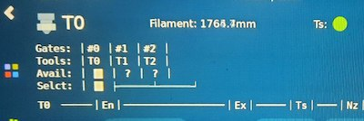

# 📌 ANNOUNCEMENT: KlipperScreen-Happy Hare edition now requires an upgraded Happy Hare v2 software
Happy Hare v2 [available here](https://github.com/moggieuk/Happy-Hare)

# KlipperScreen

KlipperScreen is a touchscreen GUI that interfaces with [Klipper](https://github.com/kevinOConnor/klipper) via [Moonraker](https://github.com/arksine/moonraker). It can switch between multiple printers to access them from a single location, and it doesn't even need to run on the same host, you can install it on another device and configure the IP address to access the printer.

### Documentation 

[Click here to access the documentation.](https://klipperscreen.readthedocs.io/en/latest/)

### Inspiration
KlipperScreen was inspired by [OctoScreen](https://github.com/Z-Bolt/OctoScreen/) and the need for a touchscreen GUI that
will natively work with [Klipper](https://github.com/kevinOConnor/klipper) and [Moonraker](https://github.com/arksine/moonraker).

[More Screenshots](https://klipperscreen.readthedocs.io/en/latest/Panels/)

### About the project

KlipperScreen has been created and maintained by Jordan Ruthe from 2020 to 2021

|Donate to Jordan|
|-|
|[Patreon](https://www.patreon.com/klipperscreen)|
|[Ko-fi](https://ko-fi.com/klipperscreen)|

The current maintainer is Alfredo Monclus (alfrix) from 2021 onwards

|Dontate to Alfrix|
|-|
|[Ko-fi](https://ko-fi.com/alfrix)|

thanks to all the people who helped along the way.

[Contributors](https://github.com/KlipperScreen/KlipperScreen/graphs/contributors)

 
 

KlipperScreen "Happy Hare" Fork...

# KlipperScreen - MMU Happy Hare Edition

Read more on how [MMU Panels work...](docs/MMU.md)

## Introduction
KlipperScreen Happy Hare edition is quite a mouthful!  It is a forked (but up-to-date) version of KlipperScreen designed to run/manage any MMU using the Happy Hare driver software.

:pushpin: KlipperScreen is an amazing piece of software but unfortunally lacks the level of panel integration and features I needed for this project.  I hope in the future to have changes integrated so that this becomes a layered install rather than a fork.  Until then you must follow these install directions closely. **Also note that I regularly (every 2 weeks) re-merge with the master project so the Happy Hare addition is only additive and all original functionality is untouched.**

## Installation
**Firstly, make sure Happy Hare software is completely up-to-date. Features were added to support this KlipperScreen add on.**

Install and setup a base KlipperScreen from the original source. Get it working. Don't skip this step because I cannot help with basic KlipperScreen and system setup.  Once you have that installed and working, log into you Rasberry Pi and execute the following commands. You can cut'n'paste...

    > cd ~
    > mv KlipperScreen KlipperScreen.orig
    > git clone https://github.com/moggieuk/KlipperScreen-Happy-Hare-Edition.git KlipperScreen
   
    > cd ~/KlipperScreen/happy_hare
    > ./install_ks.sh -g <num_gates>
   
(where <num_gates> is the number of selectors you built with, e.g. 9)
   
KlipperScreen will be restarted and hopefully you should now be running the enhanced version!

**Notes:**

**1:** If you are installing on a rpi without Klipper and printer attached the install will not be able to find the Klipper "config" directory where the `KlipperScreen.conf` and `mmu_klipperscreen.conf` should be placed.  To fix this, specify a `-c <config_dir>` option to the install line and specify a valid directory where KlipperScreen is expecting to see its config files.

**2:**
Expert Tip: The last step of running './install_ks -g <num_gates>' can be run many times.. if you customize the MMU part of the KlipperScreen menu and want to make use of the "replicator" function that will automatically replicate menu options for the configured number of gates, you can edit menus.conf and reference the templating there.

Note that the base KlipperScreen is up-to-date (and I will continue to merge with master every 2 weeks) with changes in the original but also includes extra menu functionality that can be used in the creation of your custom menus.  See the generated ercf_klipperscreen.conf for clues!

## Request
Remember that this is v1.0, no doubt there are cornmer cases that I haven't considered and I'd like your feedback.  I can offer limited help on the Discord channels so would prefer if you submit an issue report via github so I can manage them.  This project and Happy Hare itself have taken a lot of time. I have a lot more planned so I need your help in organizing my work.

Also, some folks have asked about making a donation to cover the cost of the all the coffee I'm drinking.  I'm not doing this for any financial reward but it you feel inclined a donation to PayPal https://www.paypal.me/moggieuk will certainly be spent making your life with MMU more enjoyable.

Thank you!

## Caveats & Possible problems / workarounds
I have only tested on a single screen.  A 640x480 resolution BTT TFT5.0.   I am not a UI programming expert and it is possible that you might find layout problems on other (likely smaller) displays.  Also, I have only tested in and optimized for horizonal orientation.  I doubt it will be effective in vertical but I don't know of any Voron owners with vertically mounted panels.

### Moonraker warning
The install updates moonraker so that KlipperScreen-happy_hare can be upgraded with update-manager. It comments out the original and inserts Happy Hare specific logic.  The one consequence of this is that you may see the following warning from Moonraker:

This is simply because I didn't want to call my software by the original name "KlipperScreen".  The fix this, click on the bell icon with line through it and select "Never" so the warning never appears again.  Note that the functionality of restarting "KlipperScreen" is still available via Mainsail.

JFYI the installer will comment out the existing original entry in moonraker if it exists and add the following:

    [update_manager KlipperScreen-happy_hare]
    type: git_repo
    path: /home/pi/KlipperScreen
    origin: https://github.com/moggieuk/KlipperScreen-Happy-Hare-Edition.git
    env: /home/pi/.KlipperScreen-env/bin/python
    requirements: scripts/KlipperScreen-requirements.txt
    install_script: scripts/KlipperScreen-install.sh
    managed_services: KlipperScreen

### Font problems:
The CSS style only specifies a "Free Mono" font to be used (this is the same as original KlipperScreen") for all textual displays.  I use the Unicode Box character set in that font to render the selector status, filament positions and TTG map. A couple of users have reported issues with this part of the display, either not appearing or not spaced correctly.  E.g.

If this occurs the first thing to try is to run the following, then restart KlipperScreen:

    sudo apt install fontconfig
    fc-cache -f -v
    sudo systemctl restart KlipperScreen

If this doesn't fix the problem I suggest installing a new font set:
Download the JetBrains fonts from (www.jetbrains.com).  Extract the zip.  Copy all the `*.ttf` fonts (you will find them under fonts/ttf in the extracted zip) into `/usr/share/fonts/truetype` directory (you will have to sudo cp else you will likely get permission denied), then cache these fonts:

    cd ..to where you extracted font files../fonts/ttf
    sudo cp *.ttf /usr/share/fonts/truetype
    fc-cache -f -v
     
Then finally update the font reference in the KlipperScreen css file:

    cd ~/KlipperScreen/styles

Edit `base.css` file.  Find the css entry for `.mmu_status`, then change the font-family to:

    font-family:      JetBrains Mono;

(it will by default be `font-family:     Free Mono;`)

Then restart KlipperScreen

    sudo systemctl restart KlipperScreen

If you have to do this, please let me know the details about the operating system you are running on and how you installed KlipperScreen in the first place... if I can locate the source of the issue I might be able to workaround in the future.

### Blank Screen after system update
It has come to my attention that sometimes a system (OS) update can break KlipperScreen.  This is nothing to do with KlipperScreen but rather the installation of a slightly broken video driver `fbturbo`.  Luckily the fix is simple.  After OS upgrade run:

    sudo apt purge xserver-xorg-video-fbturbo

Then restart KlipperScreen.

*All screen shots are taken with the "Colorize" theme (my preference because the buttons are more defined).  The default is z-bolt and looks slightly different*

## Now go read the [rest of the doc here](docs/MMU.md)...

