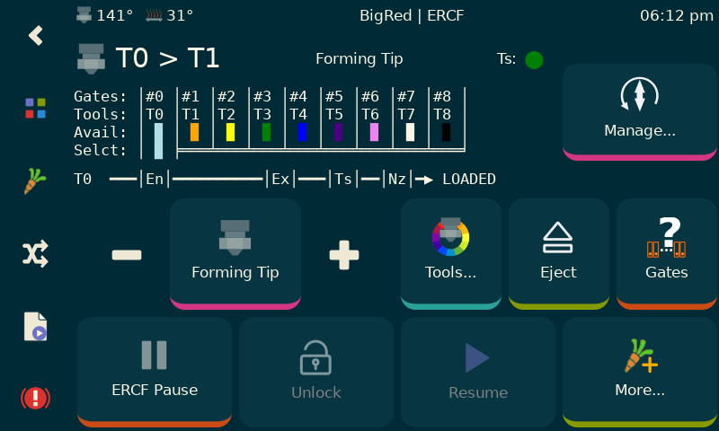
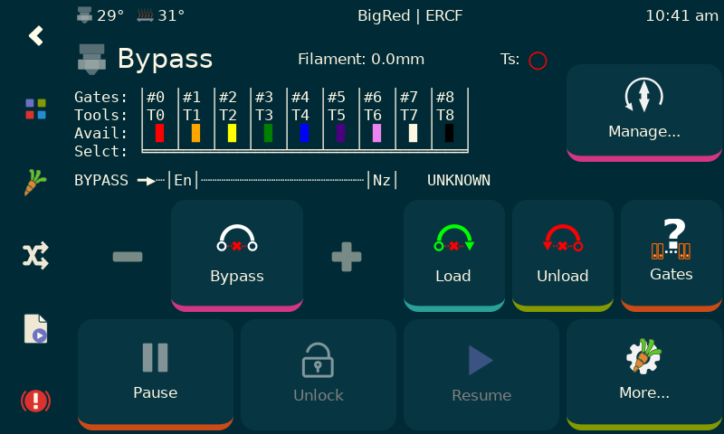
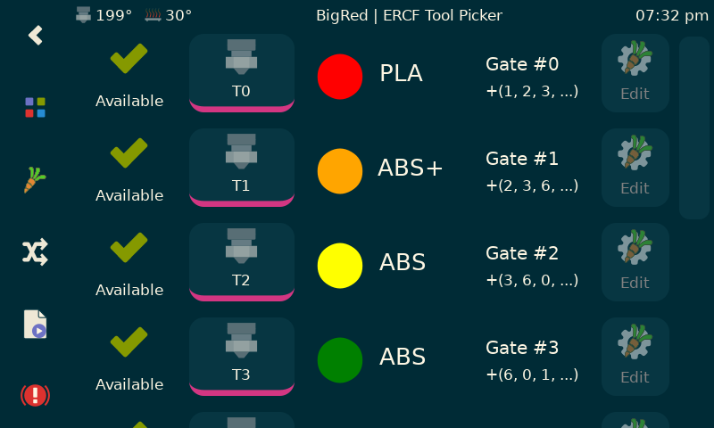
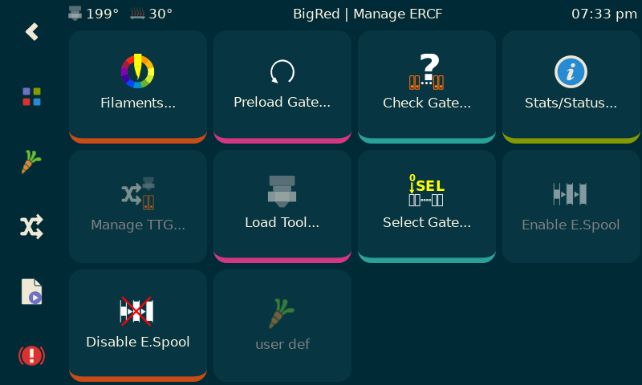

# KlipperScreen Panels for ERCF - Happy Hare

## Main Panel

This is the main screen and is accessed by clicking on the little carrot on the left navbar.   Note that you can turn off this carrot in settings in whch case buttons will automatically be added to the KlipperScreen home and print pages.  Personally I think ERCF deserves this first class link.

The philosopy behind this screen is that it works with the concept of `Tool` which is really a virtual entity in Happy Hare because of the Tool-To-Gate mapping.  When you are actually printing the panel will look a little different:

The top left button is replaced with a live monitor of Happy Hare clog/runout detection.  This "thermonitor" usually will sit at the bottom of the scale.  As the difference between extruder and encoder measured movement increases the "temperature" will rise.  If it hits the top a runout condition will be triggered.  The configurable check mark on the side is the 'headroom' used by the automatic tuning option and represents a safe gap to avoid accidental firing.  The detection length (and headroom) are all tunable, but with automatic, they will be updated at least every tool change.

_Perhaps someone can help me... now you can visualize when clog detection is triggered, can you figure out what is being done in the wipe tower -- I'll let you see for yourselves..._

If you have a bypass (aka passthrough) installed, and I think they are very useful, then clicking "to the left of" `T0` will bring you to the bypass selector:

When bypass is selected, the `Colors...` button and `Eject` button change to `Load` (Bypass) and `Unload` (Bypass) respectively.  Unloading and selecting a tool will restore the buttons.

Oh, the textual representation mirrors that you see in the Klipper console, but this one dynamically updates!

_Expert Tip: With this new level of visualization I would recommend you put Happy Hare persistence level to the maximum of `4`...  Turn on, check KlipperScreen and go..._

## Manage Panel

This screen is accessed by the top right button when not in print (you shouldn't be doing anything here while printing anyway).  Conceptually it is working in the physical space with the concept of Gate (and not Tool).  That distinction is important.   I think most functions are obvious, but the `Load Extruder` and `Unload Extruder` may be new to you.  These do exactly as there names suggest and are designed to help sort out the ERCF when it is enraged and you need to do some manual operations.

There is one very important button: `Recover State...`. Since Happy Hare is stateful and will refuse to do things if it doesn't think you should do them, you might need to correct it's state before continuing.

## Recover Panel

This is what the `Recover State...` button reveals.  It shows what Happy Hare thinks the current state is, allows you to manuall reset on the right side of the screen or 'Auto Recover' just the filament LOADED/UNLOADED state.

You can also reset all the persisted state that Happy Hare records across restarts (useful if you are running with persistence level of `4` or have messed with Tool-To-Gate maps, EndlessSpool groups or got completely confused).

One note: If you move the selector on the Manage panel you will change the gate state to another postion. This is physical are real.  Because of TTG mapping the Tool will be reset to 'unknown'.  Why?  Well, because a tool can be mapped to many gates with EndlessSpool.  A gate might not even have a tool mapped to it or it might have more that one tool.

## Tool Picker Panel

Ooops, did I include that?!? ;-)  Check back later, but rest assured, Bambu Labs AMS will not have the advantage for long!

## User extensible management panel

The bottom left `More...` button brings up this panel.  This one is not custom but uses the KlipperScreen menu concept. Therefore it is extensible by users. If included a lot of useful stuff and have replicated some functionality found elsewhere as individual descrete buttons (like load tool or select gate).  Some might prefer this but feel free to comment it out if you don't like duplication.  Also you can use the menu logic that is there as a guide to add you own special macros.

## User extensible calibration/test panel

If you really don't like typing on the Klipper console, all the important calibration and test macros can be accessed under `ERCF Settings` via the KlipperScreen `Configuration` page.

Here is the set that is included by default.

    (\_/)
    ( *,*)
    (")_(") ERCF Ready
